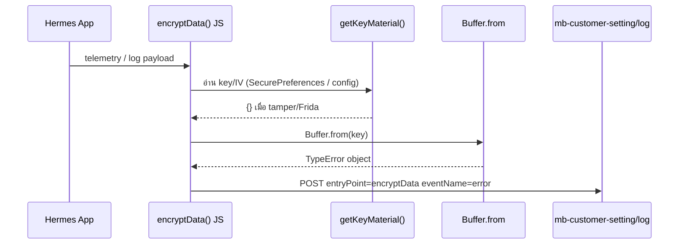

# Static Analysis — Hermes `encryptData` (SCB.Anywhere 3.9.0)

**วันที่:** 2026-06-16 · **โหมด:** static only (ไม่รันแอพ / ไม่มี emu)

---

## สรุปสั้น

| คำถาม | คำตอบ |
|--------|--------|
| Decompile Hermes `encryptData` ได้ไหม (offline) | **ไม่ได้** — bundle ถูก DexGuard asset-encrypt |
| `encryptData` ใน telemetry คือ layer ไหน | **Hermes JS** (Node `Buffer` crypto) ไม่ใช่ Java `SecureFileIO` |
| สาเหตุ TypeError ใน log | `Buffer.from(x)` ได้ `x = {}` (key material เป็น object ว่าง) |
| ทางออก static ต่อ | Reverse DexGuard decrypt ใน `libe46f.so` / `libe598.so` หรือ dump memory ตอนรัน |

---

## 1. Hermes bundle — ถูกเข้ารหัส

**ไฟล์:** `assets/index.android.bundle` (~8.3 MB)

| ตรวจ | ผล |
|------|-----|
| Header | `ad 48 69 41 cf ed 8e ec ...` |
| HBC magic มาตรฐาน | `c6 1f bc 03` — **ไม่พบ** |
| Entropy (64 KB แรก) | **~7.997** (เกือบสุ่มเต็มที่) |
| `strings` / `rg -a` ใน bundle | ไม่มี `encryptData`, `entryPoint`, `Buffer.from` |
| **hbctool disasm** | `AssertionError: magic (0xec8eedcf416948ad) is invalid` |

**ข้อสรุป:** ไฟล์นี้ไม่ใช่ Hermes bytecode แบบ Metro ปกติ แต่เป็น **DexGuard Asset Encryption** (สอดคล้อง APKiD: DexGuard 9.x บน `libe46f.so`, `libe598.so`)

---

## 2. แยก `encryptData` 3 ชั้น (อย่าสับสน)

### A) Telemetry `entryPoint: "encryptData"` (ที่พังใน main.log)

- **Layer:** Hermes JavaScript
- **หลักฐาน runtime:** `TypeError: The first argument must be one of type string, Buffer, ArrayBuffer... Received type object`
- **ลักษณะ:** error มาตรฐานของ **Node.js `Buffer.from()`** / polyfill ใน RN
- **Endpoint:** `POST .../v1/mb-customer-setting/log` พร้อม `"data": "text: "`
- **ไม่ใช่** Java native call

### B) Java `com.vkey.securefileio.SecureFileIO.encryptData`

```java
public static int encryptData(byte[] bArr, ArrayList<Byte> arrayList) {
    return SecureData.encrypt(bArr, arrayList);  // JNI → libsecurefileio.so
}
```

- โหลด `vosWrapperEx` + `securefileio` ผ่าน DexGuard obfuscated loader
- ใช้สำหรับ **V-Key secure file I/O** ไม่ใช่ telemetry AES ใน JS

### C) RN `PinEncryption` (`defpackage.ahu` → `com.scb.corporate.PinEncryption`)

- `@ReactMethod`: `encryptForLogin`, `encryptForChangePassword`, … (DexGuard obfuscate หนัก)
- โฟกัส **PIN/password** ไม่ใช่ generic `encryptData` ใน log pipeline

---

## 3. String pool DEX (static clue)

ใน `classes4.dex` มี string cluster (ไม่มี smali `const-string` xref):

```
encryptCbc
encryptData
encryptFile
encryptForLogin
encryptWorkKey
...
```

- อยู่ใกล้ crypto/RN strings อื่น แต่ **ไม่ถูกอ้างใน Java smali**
- น่าจะเป็น **ชื่อฟังก์ชันจาก JS bundle** ที่ถูก embed/duplicate ใน build หรือ dead strings จาก dependency
- **ยืนยัน:** มี `encryptCbc` + `encryptData` คู่กัน → JS น่าใช้ **AES-CBC** (ไม่ใช่ GCM-only)

---

## 4. Reconstructed JS flow (จาก error + architecture)



**Inference:**

1. มี wrapper ชื่อ `encryptData` ใน JS ห่อ plaintext ก่อนส่ง analytics
2. Key derivation อ่านจาก secure storage — เมื่อ V-OS/ThreatCast detect hook → คืน **empty object**
3. `"data": "text: "` = prefix `"text: "` + ส่วนที่ encrypt ไม่ทัน (string ว่าง)

**เกี่ยวข้อง Java (indirect):**

| Module | RN name (obfuscated) | บทบาท |
|--------|----------------------|--------|
| `VGSecurePreferences` | string decrypt ใน `getName()` | get/put SecurePreferences |
| `ReactNativeSecurity` | string decrypt ใน `getName()` | RASP checks |
| `PinEncryption` | string decrypt ใน `getName()` | PIN crypto |

---

## 5. สิ่งที่ทำแล้ว / ทำไม่ได้ (offline)

| ลองแล้ว | ผล |
|---------|-----|
| Extract bundle จาก APK | OK → `dump/hermes/index.android.bundle` |
| strings / rg ใน bundle | ไม่มี plaintext |
| hbctool / hermes-dec | Fail — invalid magic |
| jadx `SecureFileIO`, `PinEncryption` | Java layer ชัด, JS ไม่ |
| smali xref `encryptData` | **ไม่มี** const-string |
| strings ใน `libe46f.so` หา bundle path | ไม่มี (DexGuard encrypt strings ด้วย) |

---

## 6. ทางต่อ (ถ้าต้องการ JS จริง)

1. **DexGuard asset decrypt** — Ghidra `libe46f.so` / `libe598.so` หา decrypt routine ตอน `ReactInstance` โหลด bundle
2. **Memory dump** (ต้องรันแอพ) — หลัง decrypt ใน RAM จะได้ HBC จริง → `hbctool` / `hermes-dec`
3. **Frida บน decrypt output** — hook `JSBundleLoader` / file read หลัง DexGuard ถอดรหัส (ยังต้องมี device)

---

## 7. DexGuard native (libe46f / libe598) — สรุป static

> **Playbook เต็ม:** [`dexguard-native-playbook.md`](dexguard-native-playbook.md)

### Static findings (2026-06-16)

| หัวข้อ | ผล |
|--------|-----|
| APKiD | DexGuard **9.x** ทั้ง `libe46f.so`, `libe598.so` |
| Export | **`JNI_OnLoad` only** (598 เพิ่ม `__emutls_get_address`) |
| Strings | **เข้ารหัส** — ไม่มี `index.android`, AES S-box, ChaCha |
| JNI_OnLoad VA | **e598=`0xb7d24`** (33 KB) · **e46f=`0x131af8`** (42 KB) |
| Java load | **ไม่มี** `loadLibrary("e46f")` ใน smali — โหลดผ่าน **`MainApplication.attachBaseContext`** + `Lvj;->c(I)` reflection |
| Bundle name | `"index.android.bundle"` ใน **classes.dex** · `ReactNativeHost.getBundleAssetName()` |
| RN native read | `loadScriptFromAssets` @ libreactnative.so **`0x45f580`** → `AAssetManager_fromJava` |

### Load chain (ย่อ)

```
attachBaseContext (DexGuard/vj) → … load native …
onCreate → SoLoader.init → ReactInstance
JSBundleLoader.createAssetLoader → jniLoadScriptFromAssets @ 0x450850
  → loadScriptFromAssets @ 0x45f580  [DexGuard decrypt น่าอยู่ก่อนจุดนี้]
```

---

## Artifacts

```
lab/apps/scb-cop/dump/hermes/index.android.bundle
lab/apps/scb-cop/dump/native-libs/lib/arm64-v8a/libe46f.so
lab/apps/scb-cop/dump/native-libs/lib/arm64-v8a/libe598.so
lab/apps/scb-cop/reports/hermes-encryptData-static.md  (ไฟล์นี้)
lab/apps/scb-cop/reports/dexguard-native-playbook.md
```
