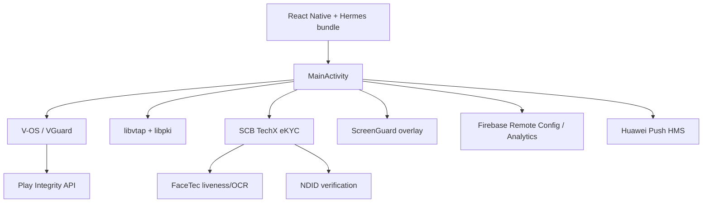

# Survey — SCB.Anywhere (Corporate) 3.9.0

**แหล่ง:** `lab/inbox/scb.cop.apk`  
**slug:** `scb-cop`  
**วันที่:** 2026-06-16  
**เครื่องมือ:** APKiD 3.1.0, aapt, strings, unzip (static only)

---

## สรุปสั้น

แอป **SCB.Anywhere** (ธนาคารไทยพาณิชย์ — นิติบุคคล) สร้างด้วย **React Native + Hermes** มีชั้นความปลอดภัยหนัก: **V-OS (Vkey)**, **DexGuard 9.x**, **Play Integrity API**, eKYC (FaceTec + NDID), ScreenGuard

| ฟิลด์ | ค่า |
|-------|-----|
| Package | `com.scb.corporate` |
| ชื่อแสดง | SCB.Anywhere |
| Version | 3.9.0 (code **980**) |
| Min/Target SDK | 29 / 36 |
| ขนาด APK | ~115 MB (universal — 4 ABI) |
| DEX | 5 ไฟล์ (~43 MB รวม) |
| Deep link | `scbanywhere://` |

**ต้อง emu ไหม:** **ใช่** — bypass V-OS/DexGuard, ทดสอบ VTAP/secure channel, eKYC flow

---

## สถาปัตยกรรม



**Native entry:** `com.scb.corporate.MainApplication` → `MainActivity`  
**JS bundle:** `assets/index.android.bundle` (~8.3 MB, Hermes bytecode — อ่าน string ตรงๆ ไม่ได้)

---

## APKiD

| ชั้น | ผล |
|------|-----|
| APK | manipulator: **Resources Confusion** · protector: **Vkey (V-OS App Protection)** |
| classes.dex,3,4 | **Play Integrity API** + anti-VM หลายแบบ |
| classes3.dex | anti_debug: `Debug.isDebuggerConnected()` |
| classes4.dex | anti_vm: `ro.kernel.qemu` |
| libe46f.so, libe598.so | obfuscator: **DexGuard 9.x** |
| libvosWrapperEx.so | **Vkey (V-OS App Protection)** (ทุก ABI) |

ไฟล์: `survey/apkid.json`

---

## Security stack (native + assets)

| Component | หลักฐาน |
|-----------|---------|
| V-OS / VGuard | `libvosWrapperEx.so`, `assets/vkeylicensepack`, `assets/voscodesign.vky`, `com.vkey.android.vguard.*` |
| DexGuard | `libe46f.so`, `libe598.so` (APKiD) |
| VTAP / PKI | `libvtap.so`, `libpki.so`, `com.scb.corporate.vkey.vtap.RNUtil` |
| Secure I/O | `libsecurefileio.so`, `com.vkey.securefileio.SecureFileIO` |
| Anti-tamper | `libchecks.so`, `libloadTA.so` |
| Phoenix SDK | `libPhoenixAndroid.so` (~3.5 MB arm64) |
| Screen capture guard | `com.screenguard.ScreenGuardColorActivity` |
| Play Integrity | APKiD บน DEX |

---

## eKYC / Identity

| SDK | Activity / class |
|-----|------------------|
| SCB TechX eKYC | `OcrIdCardActivity`, `ReviewInformationEkycActivity`, `NdidVerificationActivity` |
| FaceTec | `FaceTecSessionActivity` (exported), assets ใน `com/facetec/sdk/` |
| NDID | strings: `NDID_VERIFICATION_ENROLLMENT_DISPLAY`, `NdidIdpRequestEntity` |

FaceTec endpoint (จาก strings): `https://api.facetec.com/api/v3.1/biometrics/liveness-3d`

---

## Permissions (ไฮไลต์)

- `INTERNET`, `ACCESS_NETWORK_STATE`, `ACCESS_WIFI_STATE`
- `CAMERA`, `NFC`, `USE_BIOMETRIC`, `USE_FINGERPRINT`
- `POST_NOTIFICATIONS`, `QUERY_ALL_PACKAGES`
- `READ/WRITE_EXTERNAL_STORAGE` (write maxSdk 29)
- Huawei push: `com.scb.corporate.permission.PROCESS_PUSH_MSG`, badge permissions หลาย OEM
- `usesCleartextTraffic=true` · `allowBackup=false`

---

## Manifest / attack surface

| รายการ | รายละเอียด |
|--------|------------|
| Launcher | `com.scb.corporate.MainActivity` (**exported**) |
| Deep link | scheme `scbanywhere` |
| FaceTec | `FaceTecSessionActivity` (**exported**) |
| eKYC review/NDID | บาง activity **exported** |
| Dev menu | `DevSettingsActivity` (React Native dev support — ตรวจ release build) |

---

## Native libs (arm64-v8a — ตัวอย่าง)

| Library | ขนาดโดยประมาณ | หมายเหตุ |
|---------|----------------|----------|
| libreactnative.so | ~6.6 MB | RN core |
| libreanimated.so | ~3.0 MB | Reanimated |
| libPhoenixAndroid.so | ~3.5 MB | Phoenix SDK |
| libpdfium.so | ~4.8 MB | PDF viewer |
| libbarhopper_v3.so | ~4.9 MB | ML Kit barcode |
| libvosWrapperEx.so | ~1.8 MB | V-OS wrapper |
| libsecurefileio.so | ~1.5 MB | Vkey secure file I/O |
| libhermes.so | ~2.1 MB | JS engine |
| libe46f.so / libe598.so | ~1.6 / 1.2 MB | DexGuard runtime |
| libpki.so | ~55 KB | PKI/crypto |
| libvtap.so | ~16 KB | VTAP token |
| libchecks.so | ~25 KB | integrity checks |

รองรับ **arm64-v8a, armeabi-v7a, x86, x86_64** (~140 `.so` รวมทุก ABI)

---

## Third-party / cloud

| บริการ | หลักฐาน |
|--------|---------|
| Firebase | Analytics, Crashlytics, Remote Config; `corporate-portal-live.firebaseio.com` |
| Huawei HMS | `HMSCore-*.properties`, `hmsrootcas.bks`, push permissions |
| FaceTec | biometric liveness + ID scan |
| Google ML Kit | barcode models ใน assets |
| Gradle/Kotlin | AGP 8.11.2, Kotlin 2.1.20, Java 17 |

---

## URLs / domains (static)

Endpoint หลักของแอปน่าจะอยู่ใน **Hermes bundle** หรือ **Firebase Remote Config** — static strings ไม่เจอ production API host ชัดเจน

ที่พบใน binary:
- `https://corporate-portal-live.firebaseio.com`
- `http://localhost/agc/apigw/oauth2/v1/token` (Huawei AGC template / placeholder)
- FaceTec, Firebase, Google Play Integrity docs

---

## ขั้นถัดไป (แนะนำ)

1. **Emulator + rooted device** — arm64 image; หลีกเลี่ยง x86-only emu (มี x86 libs แต่ banking app มัก block emulator)
2. **Frida / objection** — bypass V-OS + DexGuard + Play Integrity (ยาก — ต้อง patch native)
3. **Hermes decompile** — `hbctool` / `hermes-dec` บน `index.android.bundle` เพื่อดึง API base URL / route
4. **jadx** — decompile DEX (คาดว่า obfuscate หนัก; โฟกัส `com.scb.corporate`, `com.scb.techx.ekycframework`, `com.vkey.*`)
5. **Dynamic** — intercept OkHttp/React Native networking; ดัก Firebase Remote Config
6. **Ghidra** — `libvosWrapperEx.so`, `libPhoenixAndroid.so`, `libchecks.so`
7. **eKYC surface** — exported FaceTec/NDID activities, deep link `scbanywhere://`

---

## ไฟล์ artifact

```
lab/apps/scb-cop/
├── meta.json
├── source.apk          (gitignored)
├── survey/apkid.json
└── reports/survey.md   (ไฟล์นี้)
```
